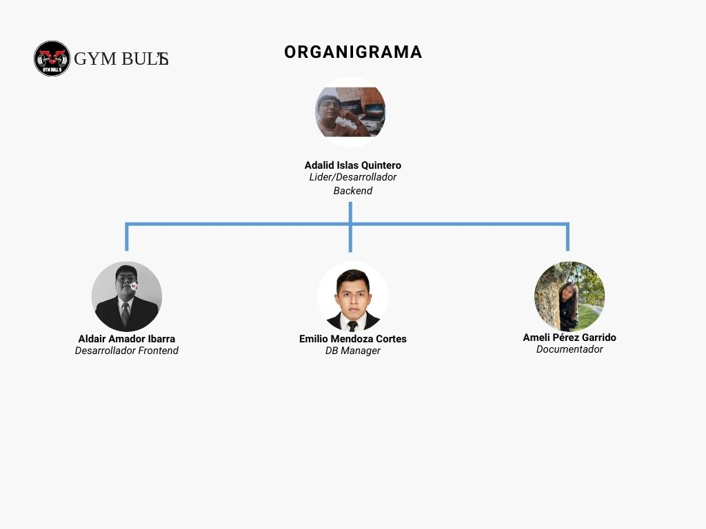
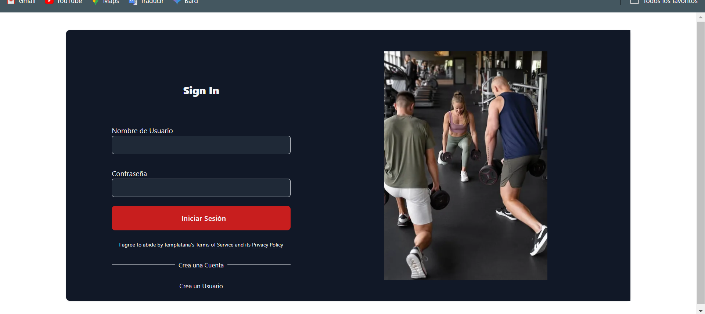

<div align = "center">

# UNIVERSIDAD TECNOLÓGICA DE XICOTEPEC DE JUÁREZ

## Ingeniería en desarrollo y gestión de software

## 9B

# Documentación GymBull

## Introducción:

GymBull es una aplicación innovadora diseñada para la gestión integral de gimnasios. Con GymBull, los administradores pueden manejar fácilmente membresías, programar clases, monitorear el progreso de los clientes y mejorar la comunicación con los miembros. Esta herramienta está diseñada para optimizar las operaciones diarias del gimnasio y ofrecer una experiencia superior tanto para los entrenadores como para los clientes.

# Objetivo

El frontend de GymBull tiene como objetivo ofrecer una experiencia de usuario fluida y eficiente, que integre de manera efectiva la gestión de gimnasio con las funcionalidades de nutrición. Proporciona una plataforma visual y funcional que apoya tanto en la administración del gimnasio como en el seguimiento y planificación nutricional.

# ORGANIGRAMA

# PASOS PARA CORRER EL REPOSITORIO

# ESTRUCTURA DEL PROYECTO

src/: Contiene los archivos fuente de la aplicación, incluyendo componentes, servicios y lógica de negocio.

components/: Componentes reutilizables de React organizados por funcionalidad.

pages/: Vistas principales o páginas de la aplicación.

services/: Servicios para la interacción con APIs y otros recursos externos.

styles/: Archivos de estilo CSS.

utils/: Utilidades y funciones auxiliares.


## Clonar el repositorio

```sh
1.- git clone https://github.com/Adalid26Islas/GimnasioFrontEnd-Deploy.git
```


## Ubicarse en la carpeta de GimnasioFrontend-Deploy para instalar todas las dependecias

```sh
2.- npm i 
```

## Correr el proyecto con el comando

```sh
3.- npm run dev
```


# CONCLUSIÓN

La documentación del frontend de GymBull proporciona una guía completa para el desarrollo y mantenimiento del proyecto, garantizando que todos los miembros del equipo puedan colaborar de manera eficiente. Esta documentación cubre desde la estructura del proyecto hasta los procesos de instalación, configuración y despliegue, ofreciendo un recurso claro y detallado para desarrolladores nuevos y existentes.

</div>